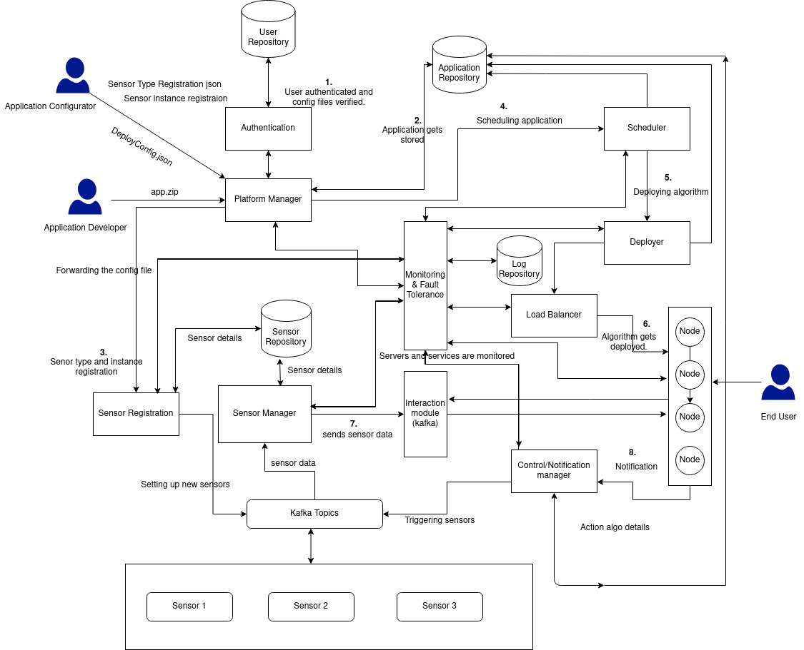

# Distributed IOT Platform

- A distributed IOT platform which provides functionalities to develop an application involving interaction with multiple sensors, analyzing the data from the sensors and taking action on the sensors.
- The platform is able to register new sensor type and sensors.
- The application can be developed at the developers side, the sensors needed can be easily registered on the platform, and then the application can be scheduled and deployed over the platform following the application model defined by our platform.

